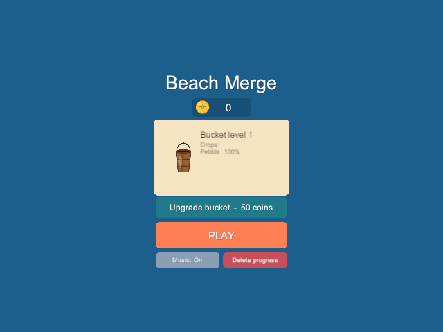
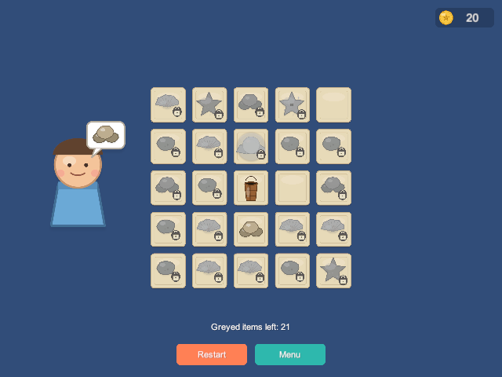
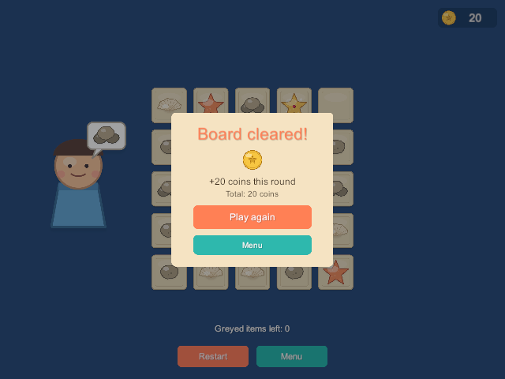
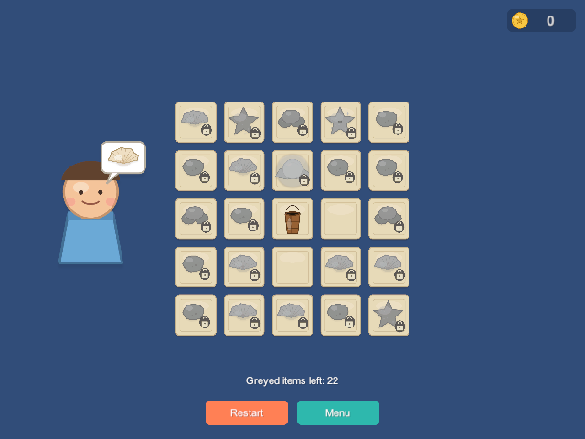
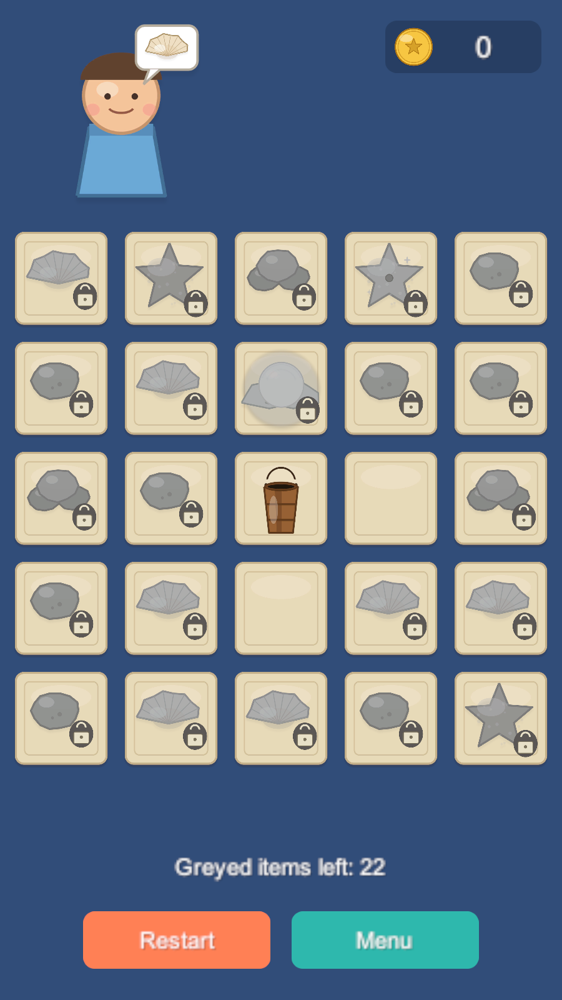
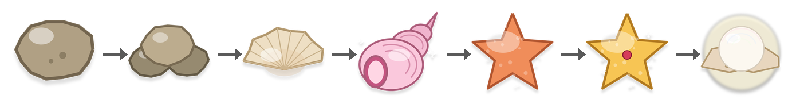
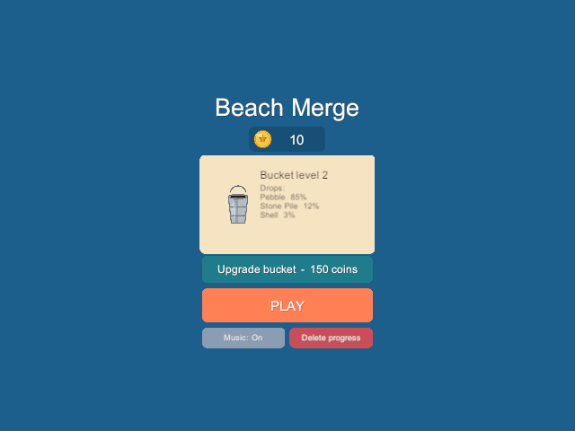

# Beach Merge

A small 2D merge-puzzle game made in Unity, inspired by the board in *Travel Town*. Tap the bucket to collect beach items, merge matching pairs into better ones, use them to free the greyed-out items on the board, and trade finds with a villager for coins you can spend on a better bucket.

<p align="center">
  
  
  
</p>

## How to play

**Goal:** clear every greyed-out item from the board.

<p align="center">
  
  
</p>

Every board starts almost full: only two cells next to the bucket are empty. Greyed-out items can be anything in the merge chain, and every board has at least one greyed Pearl and one greyed Starfish to work toward.

1. **Tap the bucket** in the middle of the board. It drops a new item into the nearest empty cell. If there are no empty cells, it can't drop anything, so space is your most important resource.
2. **Merge by dragging.** Drop an item onto an identical item and they combine into the next item in the chain. The cell you dragged from becomes empty again.
3. **Free greyed-out items.** A greyed-out item with a lock shows what it's waiting for. Drag a matching item onto it and the two merge into the next tier, unlocking that cell for good.
4. **Help the villager.** The villager next to the board shows what they want in their speech bubble. Drag that item onto them to earn coins. Higher-tier requests pay more.
5. **Clear the board.** When the last greyed-out item is freed, you'll see how many coins you earned that round, and you can play again on a new board.

Dropping an item anywhere it can't go (a different item, a locked cell that wants something else, empty space) just sends it back to where it was.

### The merge chain

Two of the same item always make one of the next:

<p align="center">
  
</p>

**Pebble → Stone Pile → Shell → Shiny Shell → Starfish → Golden Starfish → Pearl**

The Pearl is the top of the chain and can't be merged further.

### Coins and bucket upgrades

<p align="center">
  
</p>

Coins from the villager are saved between sessions. Spend them in the start menu to upgrade your bucket. Each level keeps mostly dropping Pebbles, but adds a small chance of skipping ahead:

| Bucket | Upgrade cost | Drops |
|---|---|---|
| Level 1 (wood) | — | Pebble 100% |
| Level 2 (tin) | 50 coins | Pebble 85%, Stone Pile 12%, Shell 3% |
| Level 3 (gold) | 150 coins | Pebble 70%, Stone Pile 20%, Shell 8%, Shiny Shell 2% |

### Menu options

- **Play** deals a fresh board.
- **Music: On / Off** toggles the background music.
- **Delete progress** resets your coins and bucket level. Tap it twice to confirm.

During a round, **Restart** deals a new board and **Menu** returns to the start menu.

## Running the game

1. Install **Unity 6000.4.6f1** (Unity 6) through Unity Hub.
2. Clone this repository and open the folder in Unity Hub (**Add → Add project from disk**).
3. Open `Assets/Scenes/SampleScene.unity` and press **Play**.

The layout adapts to the screen: on wide screens the villager stands beside the board, on phone-shaped screens above it. Input uses the new Input System, so both mouse and touch work.

Your coins, bucket level and music setting are saved to `save.json` in Unity's per-user data folder (`Application.persistentDataPath`), e.g. `%USERPROFILE%\AppData\LocalLow\DefaultCompany\travel_town__mimic\` on Windows.

## Project structure

```
Assets/
├─ Art/Sprites/          Item, board, bucket, and villager sprites
├─ Data/
│  ├─ Items/             ItemData assets: the 7-step merge chain
│  └─ Bucket/            BucketTierData assets: drop tables and upgrade costs
├─ Prefabs/              BoardSlot and MergeItem
├─ Resources/            Music loop and coin icon (loaded at runtime)
├─ Scenes/SampleScene    The game scene
├─ Scripts/              Game code (see below)
└─ Tests/PlayMode/       Automated playtest
tools/                   Music generator and playtest runner
docs/                    README images
```

Main scripts:

| Script | What it does |
|---|---|
| `GameManager` | Game flow (menu → playing → finished), drop resolution, upgrades, saving |
| `BoardManager` | Builds the grid and tracks each cell as locked, filled, or empty |
| `Bucket` | Picks a weighted random item and drops it into the nearest empty cell |
| `DragController` | Picks up, drags, and releases items with mouse or touch |
| `VillagerManager` | Rolls requests, shows them in the speech bubble, pays coins |
| `CurrencyManager` | Holds the coin balance and notifies listeners when it changes |
| `UIManager` | Builds the menu, in-game HUD, and finish screen in code |
| `MusicPlayer` | Loops the background music |
| `SaveManager` | Reads and writes `save.json` |

Items and bucket levels are data assets (ScriptableObjects), so you can add items or rebalance drop rates in the Inspector without touching code.

## Automated playtest

`Assets/Tests/PlayMode/PlaytestBot.cs` plays the real scene with a simulated mouse on three different random boards. It goes through the start menu, bucket drops, merging, unlocking greyed-out items, invalid drops, feeding the villager, clearing the board, restarting, upgrading the bucket, toggling music, and deleting progress, checking the result of each step and the save file along the way.

Run it from the Unity **Test Runner** window (PlayMode tab), or headless from PowerShell, which also works while the project is open in the Editor:

```powershell
.\tools\playtest.ps1
```

The script runs the tests on a temporary copy of the project and saves a screenshot of each step. The screenshots in this README came from it.

## Art and music

All art and music were generated with code, not drawn or recorded by hand:

- The sprites were drawn with Python and Pillow as flat vector-style shapes.
- The background music is a 33-second tropical house loop synthesized with NumPy by `tools/generate_music.py`. Run `python tools/generate_music.py` to rebuild it after editing the tempo, chords, or melody.

## Background

This project started as a way to learn Unity and C#. [`GAMEPLAN.md`](GAMEPLAN.md) is the original step-by-step learning roadmap, from project setup through the game loop, saving, and polish.
